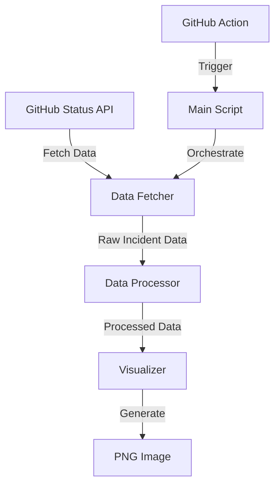

# Design Document: GitHub Incident Visualizer

## Overview

The GitHub Incident Visualizer is a Python-based tool that generates visual representations of GitHub's historical incidents by severity over time. The system will fetch incident data from GitHub's status API, process and categorize this data, and generate a PNG image showing the distribution of incidents by severity across monthly time periods. This visualization will be automated through a GitHub Action that can be scheduled to run periodically.

## Architecture

The system will follow a modular architecture with clear separation of concerns:

```
github-incident-visualizer/
├── src/
│   ├── data_fetcher.py      # Handles API requests and data retrieval
│   ├── data_processor.py    # Processes and categorizes incident data
│   ├── visualizer.py        # Generates the visualization
│   └── main.py              # Entry point that orchestrates the workflow
├── tests/                   # Unit and integration tests
├── .github/
│   └── workflows/           # GitHub Actions workflow definitions
└── README.md                # Project documentation
```

### Component Flow



## Components and Interfaces

### 1. Data Fetcher

Responsible for retrieving incident data from the GitHub Status API.

**Interface:**
```python
class DataFetcher:
    def fetch_incidents(self) -> dict:
        """
        Fetches incident data from GitHub Status API
        
        Returns:
            dict: Raw incident data from the API
        
        Raises:
            RequestError: If the API request fails
            ParseError: If the response cannot be parsed
        """
        pass
```

### 2. Data Processor

Processes raw incident data, categorizing incidents by severity and organizing them by month.

**Interface:**
```python
class DataProcessor:
    def process_incidents(self, raw_data: dict) -> dict:
        """
        Process and categorize incident data by severity and time
        
        Args:
            raw_data (dict): Raw incident data from the API
            
        Returns:
            dict: Processed data organized by month and severity
            
        Example return format:
        {
            '2025-01': {'major': 3, 'minor': 5, 'none': 1},
            '2025-02': {'major': 1, 'minor': 2, 'none': 0},
            ...
        }
        """
        pass
        
    def categorize_by_severity(self, incident: dict) -> str:
        """
        Categorize an incident by its severity
        
        Args:
            incident (dict): Single incident data
            
        Returns:
            str: Severity category ('major', 'minor', etc.)
        """
        pass
        
    def organize_by_month(self, incidents: list) -> dict:
        """
        Organize incidents by month
        
        Args:
            incidents (list): List of processed incidents
            
        Returns:
            dict: Incidents organized by month
        """
        pass
```

### 3. Visualizer

Generates a PNG visualization of the processed incident data.

**Interface:**
```python
class Visualizer:
    def generate_visualization(self, processed_data: dict, output_path: str) -> None:
        """
        Generate a PNG visualization of incidents by severity over time
        
        Args:
            processed_data (dict): Processed incident data organized by month and severity
            output_path (str): Path where the PNG image will be saved
            
        Returns:
            None
        """
        pass
```

### 4. Main Script

Orchestrates the entire workflow, from data fetching to visualization generation.

**Interface:**
```python
def main() -> None:
    """
    Main entry point that orchestrates the workflow:
    1. Fetch data from GitHub Status API
    2. Process and categorize the data
    3. Generate visualization
    4. Save the visualization to the specified location
    """
    pass
```

## Data Models

### 1. Raw Incident Data

Based on the GitHub Status API response format:

```json
{
  "page": {
    "id": "string",
    "name": "string",
    "url": "string",
    "time_zone": "string",
    "updated_at": "datetime"
  },
  "incidents": [
    {
      "id": "string",
      "name": "string",
      "status": "string",
      "created_at": "datetime",
      "updated_at": "datetime",
      "monitoring_at": "datetime|null",
      "resolved_at": "datetime|null",
      "impact": "string",  // "major", "minor", "none", etc.
      "shortlink": "string",
      "started_at": "datetime",
      "page_id": "string",
      "incident_updates": [
        {
          "id": "string",
          "status": "string",
          "body": "string",
          "incident_id": "string",
          "created_at": "datetime",
          "updated_at": "datetime",
          "display_at": "datetime",
          "affected_components": [
            {
              "code": "string",
              "name": "string",
              "old_status": "string",
              "new_status": "string"
            }
          ],
          "deliver_notifications": "boolean",
          "custom_tweet": "string|null",
          "tweet_id": "string|null"
        }
      ],
      "components": [
        {
          "id": "string",
          "name": "string",
          "status": "string",
          "created_at": "datetime",
          "updated_at": "datetime",
          "position": "number",
          "description": "string",
          "showcase": "boolean",
          "start_date": "datetime|null",
          "group_id": "string|null",
          "page_id": "string",
          "group": "boolean",
          "only_show_if_degraded": "boolean"
        }
      ],
      "reminder_intervals": "array|null"
    }
  ]
}
```

### 2. Processed Incident Data

Internal data structure for processed incidents:

```python
{
    'YYYY-MM': {
        'major': count,
        'minor': count,
        'none': count,
        # Any other severity levels found
    },
    # Additional months
}
```

## Error Handling

The system will implement comprehensive error handling to ensure robustness:

1. **API Request Errors**:
   - Network connectivity issues
   - API rate limiting
   - Authentication failures
   - Unexpected response formats

2. **Data Processing Errors**:
   - Missing or malformed data fields
   - Unexpected severity categories
   - Date parsing errors

3. **Visualization Errors**:
   - Empty or insufficient data
   - File system permission issues when saving the image

Each component will raise specific exceptions that will be caught and handled appropriately by the main script. All errors will be logged with meaningful messages to aid in troubleshooting.

## Testing Strategy

### Unit Tests

1. **Data Fetcher Tests**:
   - Test successful API responses
   - Test handling of various error conditions
   - Test with mock API responses

2. **Data Processor Tests**:
   - Test incident categorization logic
   - Test date parsing and month organization
   - Test handling of edge cases (missing fields, unusual values)

3. **Visualizer Tests**:
   - Test visualization generation with various data inputs
   - Test handling of edge cases (empty data, single data point)

### Integration Tests

1. Test the complete workflow from data fetching to visualization generation
2. Test GitHub Action execution in a test environment

### Test Tools and Libraries

- pytest for unit and integration testing
- unittest.mock for mocking API responses
- pytest-cov for measuring test coverage

## GitHub Action Implementation

The GitHub Action will be defined in a workflow file (`.github/workflows/generate-visualization.yml`) with the following key components:

```yaml
name: Generate GitHub Incidents Visualization

on:
  schedule:
    - cron: '0 0 1 * *'  # Run monthly on the 1st day
  workflow_dispatch:      # Allow manual triggering

jobs:
  generate:
    runs-on: ubuntu-latest
    steps:
      - uses: actions/checkout@v4
      
      - name: Set up Python
        uses: actions/setup-python@v4
        with:
          python-version: '3.13'
          
      - name: Install dependencies
        run: |
          python -m pip install --upgrade pip
          pip install -r requirements.txt
          
      - name: Generate visualization
        run: python src/main.py
        
      - name: Upload visualization as artifact
        uses: actions/upload-artifact@v4
        with:
          name: incidents-visualization
          path: incidents-visualization.png
          retention-days: 90
```

## Security Considerations

1. **API Access**: The GitHub Status API is public and doesn't require authentication, reducing security concerns.
2. **Dependencies**: All Python dependencies will be regularly updated to address security vulnerabilities.
3. **GitHub Action**: The action will use the minimum required permissions to function properly.

## Performance Considerations

1. **Data Caching**: For frequent runs, implement caching of previously fetched data to reduce API calls.
2. **Image Optimization**: Ensure the generated PNG is optimized for size while maintaining clarity.
3. **Efficient Processing**: Optimize data processing for large datasets as the incident history grows over time.