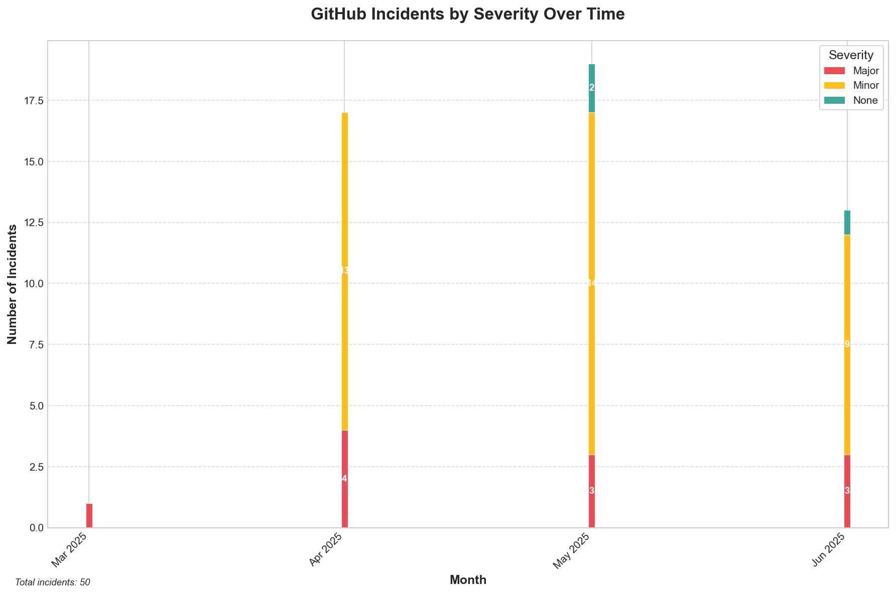

# GitHub Incident Visualizer

A Python tool that generates visual representations of GitHub's historical incidents by severity over time. This tool fetches incident data from GitHub's status API, processes and categorizes this data, and generates a PNG image showing the distribution of incidents by severity across monthly time periods.



## Features

- **Automated Data Retrieval**: Fetches incident data directly from GitHub's Status API
- **Intelligent Data Processing**: Categorizes incidents by severity and organizes them by month
- **Visual Representation**: Generates clear, color-coded visualizations showing incident trends over time
- **GitHub Action Integration**: Automatically generates updated visualizations on a schedule
- **Flexible Configuration**: Customizable through command-line arguments
- **Advanced Caching**: Intelligent caching mechanism to reduce API calls for frequent runs
- **Optimized Visualizations**: High-quality, accessible visualizations with customizable parameters

## Installation

### Prerequisites

- Python 3.11 or higher
- pip (Python package installer)

### Steps

1. Clone this repository:
   ```bash
   git clone https://github.com/yourusername/github-incident-visualizer.git
   cd github-incident-visualizer
   ```

2. Install the required dependencies:
   ```bash
   pip install -r requirements.txt
   ```

## Usage

### Basic Usage

Run the tool with default settings:

```bash
python src/main.py
```

This will:
1. Fetch incident data from GitHub's Status API
2. Process and categorize the data
3. Generate a visualization saved as `github_incidents_visualization.png` in the current directory

### Command-Line Options

The tool supports several command-line arguments for customization:

```bash
python src/main.py --help
```

Available options:

- `--api-url URL`: Specify a custom GitHub Status API URL (default: https://www.githubstatus.com/api/v2/incidents.json)
- `--output PATH`: Specify the output path for the visualization (default: github_incidents_visualization.png)
- `--log-level LEVEL`: Set the logging level (DEBUG, INFO, WARNING, ERROR, CRITICAL) (default: INFO)

**Caching Options:**
- `--cache-dir DIR`: Directory to store cached API responses (default: .cache)
- `--cache-ttl SECONDS`: Cache time-to-live in seconds (default: 3600)
- `--no-cache`: Disable caching and always fetch fresh data
- `--cache-file PATH`: Legacy option for backward compatibility (deprecated, use --cache-dir instead)

**Visualization Options:**
- `--dpi VALUE`: DPI (dots per inch) for the output image (default: 150)
- `--fig-width INCHES`: Width of the figure in inches (default: 12)
- `--fig-height INCHES`: Height of the figure in inches (default: 8)

### Examples

Generate a visualization with a custom output path:

```bash
python src/main.py --output custom_path/my_visualization.png
```

Use advanced caching to reduce API calls:

```bash
python src/main.py --cache-dir .cache --cache-ttl 86400
```

Generate a high-resolution visualization:

```bash
python src/main.py --dpi 300 --fig-width 16 --fig-height 10
```

Set a more verbose logging level:

```bash
python src/main.py --log-level DEBUG
```

## GitHub Action Integration

This project includes a GitHub Action workflow that automatically generates updated visualizations on a schedule.

### Workflow Configuration

The workflow is defined in `.github/workflows/generate-visualization.yml` and is configured to:

1. Run monthly on the 1st day of each month
2. Allow manual triggering through the GitHub Actions UI
3. Generate the visualization and save it as an artifact
4. Commit the updated visualization to the repository

### Manual Trigger Options

When manually triggering the workflow, you can customize:

- **Output Filename**: The name of the generated visualization file
- **Log Level**: The logging level for the script execution
- **DPI**: Resolution of the output image (dots per inch)
- **Figure Width**: Width of the visualization in inches
- **Figure Height**: Height of the visualization in inches

### Setting Up in Your Repository

To use this GitHub Action in your own repository:

1. Fork or clone this repository
2. Ensure the repository has the necessary directory structure:
   ```
   your-repo/
   ├── .github/
   │   └── workflows/
   │       └── generate-visualization.yml
   ├── src/
   │   ├── data_fetcher.py
   │   ├── data_processor.py
   │   ├── visualizer.py
   │   └── main.py
   ├── output/
   └── requirements.txt
   ```

3. Customize the workflow file if needed (e.g., change the schedule)
4. Commit and push the changes to your repository
5. The workflow will run automatically according to the schedule, or you can trigger it manually from the Actions tab

## Project Structure

```
github-incident-visualizer/
├── .github/
│   └── workflows/
│       └── generate-visualization.yml  # GitHub Action workflow definition
├── src/
│   ├── data_fetcher.py      # Handles API requests and data retrieval
│   ├── data_processor.py    # Processes and categorizes incident data
│   ├── visualizer.py        # Generates the visualization
│   └── main.py              # Entry point that orchestrates the workflow
├── tests/
│   └── unit/
│       ├── test_data_fetcher.py
│       ├── test_data_processor.py
│       ├── test_visualizer.py
│       └── test_integration.py
├── output/                  # Directory for generated visualizations
├── requirements.txt         # Python dependencies
└── README.md                # Project documentation
```

## Development

### Running Tests

Run the test suite:

```bash
pytest
```

Run tests with coverage:

```bash
pytest --cov=src
```

### Contributing

Contributions are welcome! Please feel free to submit a Pull Request.

1. Fork the repository
2. Create your feature branch (`git checkout -b feature/amazing-feature`)
3. Commit your changes (`git commit -m 'Add some amazing feature'`)
4. Push to the branch (`git push origin feature/amazing-feature`)
5. Open a Pull Request

## License

This project is licensed under the MIT License - see the LICENSE file for details.